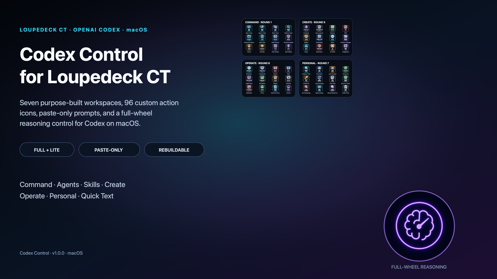
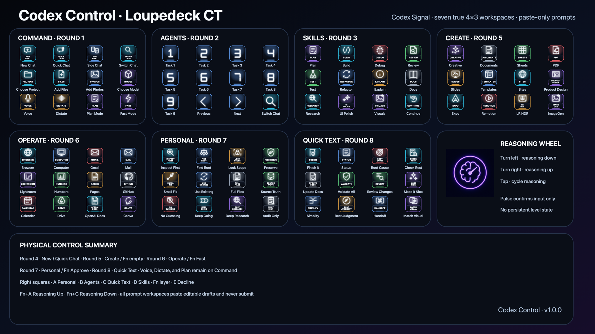
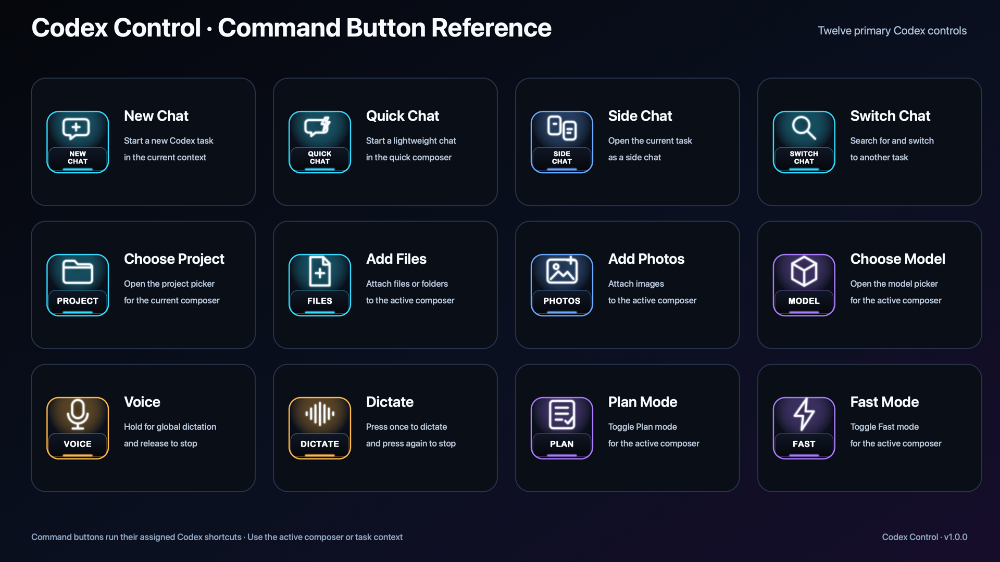
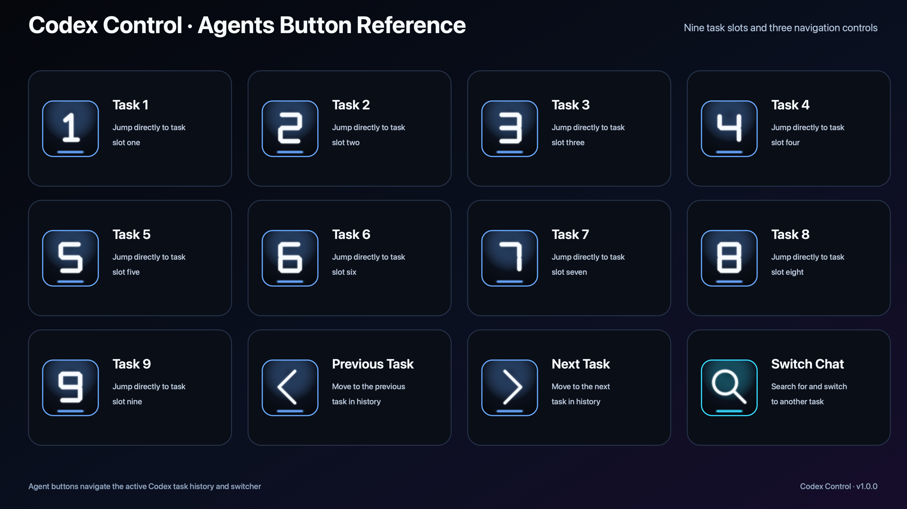
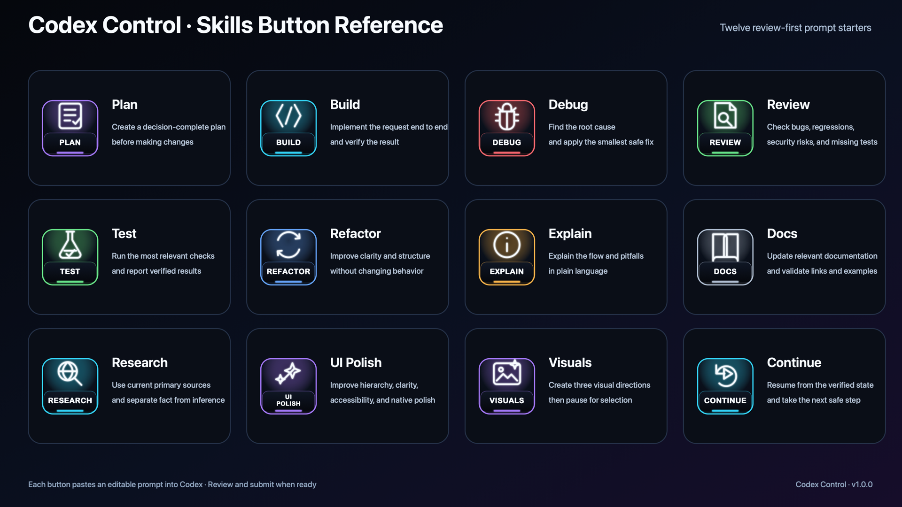
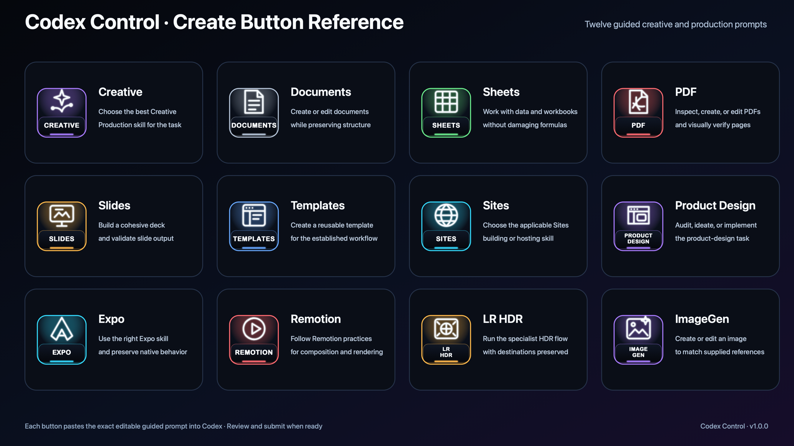
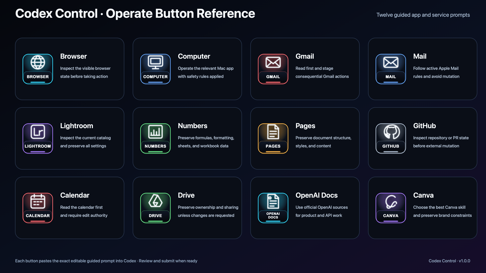
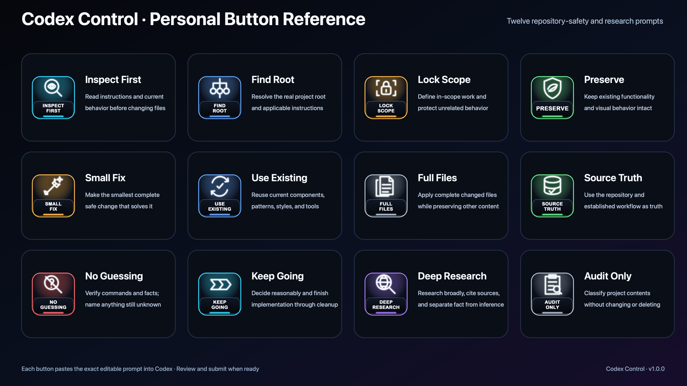
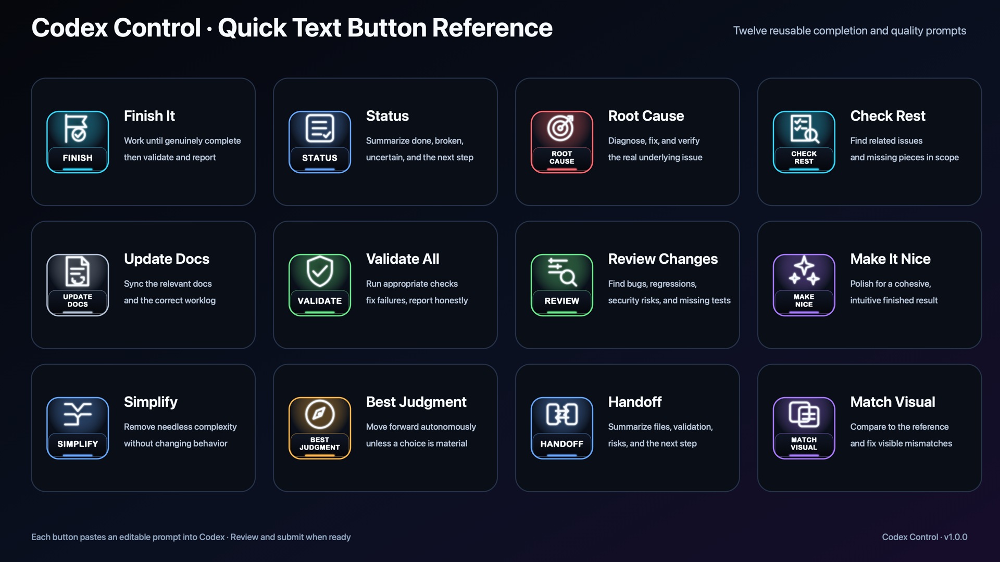
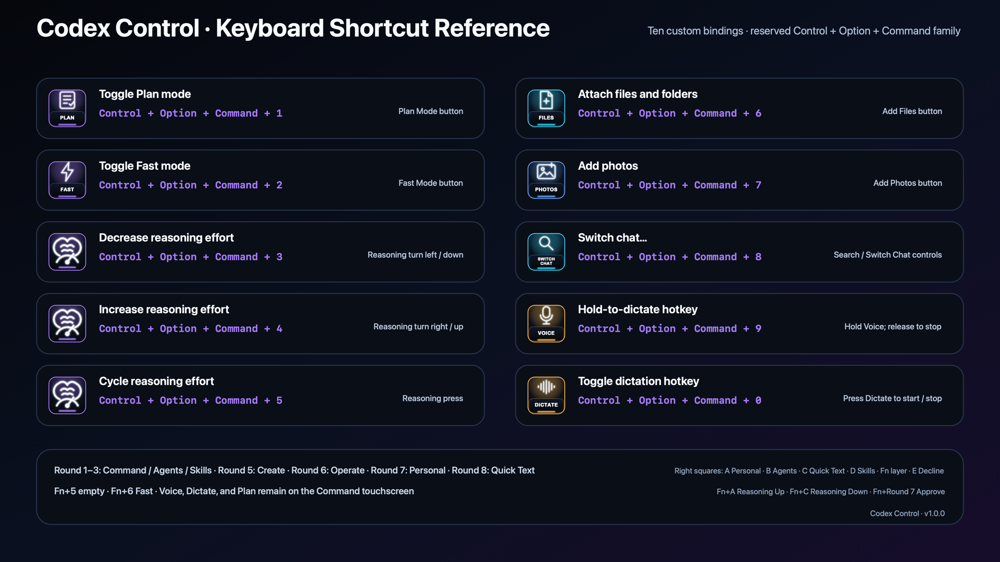

# Codex Control for Loupedeck CT — macOS



[](../../releases/latest)


[](LICENSE)

A polished seven-workspace Loupedeck CT controller for OpenAI Codex on macOS, with prompt pages, custom icons, shortcuts, and a full-wheel reasoning control.

## Download

| Choice | Download | Best for |
| --- | --- | --- |
| All in one | [Release bundle](../../releases/latest/download/Codex-Control-Loupedeck-CT-v1.0.0.zip) | Full and Lite profiles, wheel plugin, shortcut reference, checksums, and install guide |
| Full | [Full profile](../../releases/latest/download/Codex-Control-Loupedeck-CT-v1.0.0.LP4) + [wheel plugin](../../releases/latest/download/CodexControlWheel-v1.0.0.lplug4) | The premium full-surface reasoning wheel with a short input-confirmation pulse |
| Lite | [Lite profile](../../releases/latest/download/Codex-Control-Loupedeck-CT-Lite-v1.0.0.LP4) | The same seven-page controls using Loupedeck's built-in compact wheel renderer |
| Shortcuts | [Codex keybinding reference](../../releases/latest/download/codex-keybindings.json) | A reference for the ten manual Codex shortcut assignments |

Verify downloads with [SHA256SUMS.txt](../../releases/latest/download/SHA256SUMS.txt).

## Why this controller is different

- Seven true 4×3 touchscreen workspaces: Command, Agents, Skills, Create, Operate, Personal, and Quick Text.
- 84 assigned touchscreen buttons, seven encoder pages, seven wheel pages, eight round-button mappings, and twelve square-button mappings.
- 96 action icons: 95 editable SVG-backed actions plus one raster wheel action.
- Five prompt workspaces that paste editable text but never press Return or submit automatically.
- Full and Lite wheel implementations with the same reasoning-down, reasoning-up, and cycle behavior.
- Reproducible profile generation, exact prompt validation, archive checks, and an automated privacy audit.
- No application launchers disguised as plugin mentions: Create and Operate paste clear guided prompts that Codex can interpret in context.

## Gallery

### Complete control map



| Command | Agents |
| --- | --- |
|  |  |

| Skills | Create |
| --- | --- |
|  |  |

| Operate | Personal |
| --- | --- |
|  |  |

| Quick Text | Keyboard shortcuts |
| --- | --- |
|  |  |

## Requirements

- macOS.
- Loupedeck CT and the current Loupedeck desktop software.
- OpenAI Codex for macOS.
- Ten one-time custom shortcuts entered through Codex's **Keyboard Shortcuts** screen.
- Full only: .NET 8 runtime support through the installed Logi Plugin Service and the included `CodexControlWheel` plugin.

Windows compatibility is not claimed. Other Loupedeck models are not included in the release profile.

## Install in five steps

1. In Loupedeck, export or otherwise back up the profile you currently use.
2. Choose Full or Lite. For Full, install `CodexControlWheel-v1.0.0.lplug4` before importing the profile.
3. Import the chosen `.LP4` profile in the Loupedeck application.
4. Restart the Loupedeck application and Logi Plugin Service if the new profile or wheel does not appear immediately.
5. Open Codex, press `Command + /`, and manually assign the ten shortcuts shown below.

The detailed sequence, restart guidance, and verification steps are in [Installation](docs/INSTALL.md).

## Required Codex shortcuts

Codex's Keyboard Shortcuts screen is the authority. The bundled JSON is a reference and a read-only comparison target; do not replace a larger customized file with it.

| Codex command | Assign |
| --- | --- |
| Toggle Plan mode | `Control + Option + Command + 1` |
| Toggle Fast mode | `Control + Option + Command + 2` |
| Decrease reasoning effort | `Control + Option + Command + 3` |
| Increase reasoning effort | `Control + Option + Command + 4` |
| Cycle reasoning effort | `Control + Option + Command + 5` |
| Attach files and folders | `Control + Option + Command + 6` |
| Add photos | `Control + Option + Command + 7` |
| Switch chat | `Control + Option + Command + 8` |
| Hold-to-dictate hotkey | `Control + Option + Command + 9` |
| Toggle dictation hotkey | `Control + Option + Command + 0` |

Run the read-only checker after setup:

```sh
npm run check-shortcuts
```

It reports missing assignments and chord conflicts without changing Codex. See [Keyboard shortcuts](docs/SHORTCUTS.md) for built-in shortcuts, safe testing, and the checker's limitations.

## Workspace behavior

- **Command:** primary Codex commands, Voice, Dictate, Plan, and Fast.
- **Agents:** task slots 1–9, previous/next task, and Switch Chat.
- **Skills:** twelve general plan/build/debug/review prompt starters.
- **Create:** guided prompts for Creative Production, Documents, Spreadsheets, PDF, Presentations, Templates, Sites, Product Design, Expo, Remotion, Lightroom HDR, and ImageGen.
- **Operate:** guided prompts for Browser, Computer Use, Gmail, Apple Mail, Lightroom Classic, Numbers, Pages, GitHub, Calendar, Drive, OpenAI Docs, and Canva.
- **Personal:** reusable project-safety and research guardrails. The name describes a personal prompt toolkit; the page contains no private identity or account data.
- **Quick Text:** concise completion, validation, handoff, and visual-match prompts.

Every Skills, Create, Operate, Personal, and Quick Text macro contains exactly one `TypeText` action. The text lands in the active composer for review; the controller does not press Return. See [Workspace maps and prompts](docs/WORKSPACES.md).

## Physical controls

- Round 1 / 2 / 3: Command / Agents / Skills.
- Round 4: New Chat; Fn opens Quick Chat.
- Round 5: Create; Fn is intentionally empty.
- Round 6: Operate; Fn toggles Fast.
- Round 7: Personal; Fn approves the active controlled prompt.
- Round 8: Quick Text.
- Right squares A / B / C / D: Personal / Agents / Quick Text / Skills.
- Fn+A / Fn+C: Reasoning Up / Reasoning Down.
- E: Decline or cancel.
- Center wheel: turn left/down, turn right/up, and tap/cycle reasoning effort.

Approve and Decline use Return and Escape. Test them only against a controlled prompt—not against a real pending action.

## Customize and rebuild

The release is not a black box. Editable SVGs live in `src/icons/`; the sanitized baseline is in `src/profile-base/`; the C# wheel source is in `src/wheel-plugin/`; and the deterministic generator and validator are in `tools/`.

```sh
npm run artwork
npm run sdk
dotnet build src/wheel-plugin/CodexControlWheelPlugin.csproj -c Release
npm run release
```

`npm run sdk` retrieves Logitech's official `LogiPluginTool` package into ignored `build/` paths. The repository does not redistribute Logitech's SDK DLL. See [Customizing](docs/CUSTOMIZING.md) and [Building](docs/BUILDING.md).

## Verification

The release builder validates both profile variants, exact prompt text, paste-only behavior, page and control counts, action-image coverage, round and square mappings, generated JSON/SVG files, release archive structure, wheel plugin packaging, shortcut reference state, and privacy-sensitive strings. A passing structural build is not a physical-device test; use the [manual CT checklist](docs/MANUAL_TEST_CHECKLIST.md) on your own setup.

## Troubleshooting

- **Profile imports but wheel is small:** you installed Lite or the Full wheel plugin is unavailable. Install the `.lplug4`, restart Loupedeck, and reselect Full.
- **Button lights but Codex does nothing:** confirm Codex is frontmost and verify the corresponding shortcut in `Command + /`.
- **Prompt appears but does not send:** that is intentional. Review it and submit manually.
- **Existing profile changed:** restore the backup you created before import; release profile ID `C0D1472659FDA0816544EA590C12CDE3` is isolated from other local profile IDs.
- **Plugin build fails:** confirm .NET 8, rerun `npm run sdk`, and verify the official SDK package hash described in [Third-party notices](THIRD_PARTY_NOTICES.md).

More cases are covered in [Troubleshooting](docs/TROUBLESHOOTING.md).

## Contributing

Issues and focused pull requests are welcome. Preserve exact prompt text and control behavior unless the change explicitly proposes a versioned migration. Read [CONTRIBUTING.md](CONTRIBUTING.md) before submitting changes.

## License and notices

Source and original artwork are available under the [MIT License](LICENSE). Third-party software, applications, names, trademarks, and SDK components remain the property of their respective owners; see [THIRD_PARTY_NOTICES.md](THIRD_PARTY_NOTICES.md).

This independent project is not affiliated with, endorsed by, or sponsored by OpenAI, Logitech, Loupedeck, Apple, Adobe, Google, GitHub, Canva, Expo, or Remotion. Product names and trademarks are used only to describe compatibility and intended controls.
